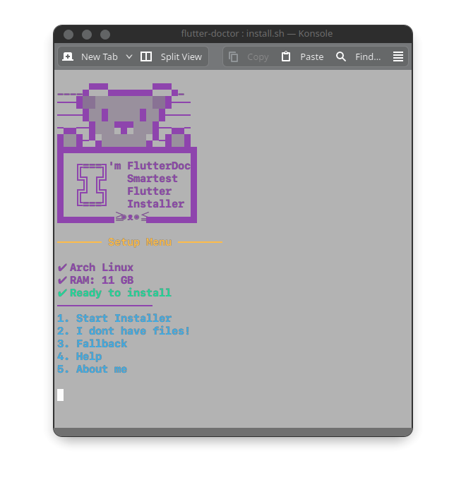

FlutterDoc [Linux + [Windows](windows/)]
==========


Hey there, fellow coder! Welcome to the FlutterDoc extravaganza! 🎉 FlutterDoc is your trusty sidekick, a bash script wizard designed to make installing Flutter on Linux as smooth as butter on a hot pancake! 🥞 With FlutterDoc, you'll be crafting cross-platform masterpieces in no time! Tested and approved on the coolest Linux distros like Arch, Ubuntu, Debian, and even Kali! 🐧

Prerequisites 📋
-------------


Before diving into the FlutterDoc wonderland, make sure your system meets the following requirements:

*  A computer you get from your great great grand father with A snazzy Linux operating system (tried and true on Arch, Ubuntu, Debian, and Kali)
*  Download Flutter and Android SDK Latest Version from the link below.

    [](https://github.com/arrahmanbd/flutter-doctor/releases/download/sdk_linux_v.1.0/Sdk.tar.xz)

    [](https://docs.flutter.dev/release/archive?tab=linux)


How to Run: 🛠️
------------

Let's get this party started, shall we?


1.  Clone this repository to your local machine:
    
    `git clone https://github.com/arrahmanbd/flutter-doctor`
    
2.  Navigate to the project directory:
    
    `cd flutter-doctor`
    
3.  Run the script:
    
    `./install.sh`
    
Watch the magic happen as FlutterDoc effortlessly fetches and installs the latest Flutter version on your system! 🎩✨
    

Usage [OPTIONS] 💡
-----

Now that you've summoned the FlutterDoc genie, let's see what tricks it has up its sleeve:

*   **Show Help:**
    
    Need a guiding hand? Just wave your magic wand:
    
    `./install.sh --help`
    
*   **Get Download Links:**
  
    Curious about the secret sauce? Ask FlutterDoc for the scoop:
    
    `./install.sh --link`
    
*   **AI Auto setup:**
    
     Feeling adventurous? Dive into the realm of AI wizardry (Alpha Version)! 🤖✨
    
    `./install.sh --ai`
    
    Just remember, this option is like stepping into the unknown—proceed with caution, brave soul!  ***Not Recommended**
    

Isn't it simple!! If you can improve this script then please contribute. For more information on how to use FlutterDoc, refer to the my [LinkedIn](https://linkedin.com/in/arrahmanbd).

## Enable Screen Mirroring 📱
You can enable screen-mirroring using <b>scrcpy</b>
### Arch/Manjaro:
```bash
sudo pacman -S scrcpy
```
### Debian/Ubuntu:
```bash
sudo apt install scrcpy
```


Demo
-----------




Contributing 🎁
------------

Got ideas brewing in your cauldron of creativity? FlutterDoc welcomes contributions like a hungry unicorn at a glitter buffet! For more fun-filled adventures with FlutterDoc, hop over to my LinkedIn profile. Let's make coding magical again! 🦄✨


## 🚀  Follow
[](https://www.linkedin.com/in/arrahmanbd)
[](https://www.github.com/arrahmanbd)
[](https://www.facebook.com/arrahman.dev)

License
-------

This project is licensed under the [MIT License](LICENSE).