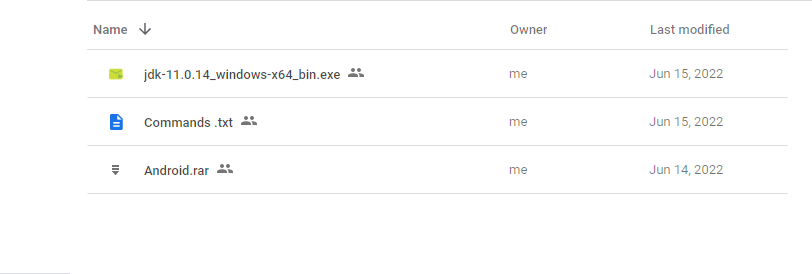

# Setup Android SDK without Android Studio

[](https://storage.googleapis.com/flutter_infra_release/releases/stable/windows/flutter_windows_3.0.2-stable.zip)


After upgrading to Flutter 3.0++ , It's very complicated to setup Android SDK Toolchain.
Neither Choco Package Manager nor Official Documentation working Properly.
That's why I have collected Android SDK Toolchan , build tools, commandline Tools,
in a package that included JAVA 11.2.0. After unzipping it, you be able to setup toolchain easily.
Happy Coding..

## Downloads



Download All Files From Google Drive

[](https://drive.google.com/drive/folders/12IKc1vYp4bWXP8wamoh8a751RPBfTOu6?usp=sharing)

## Installation

 Extract Android.rar Folder using winRar to your system root directory.


```bash
  C:\
```


 Then Install Java as normal any other software you Install.

 Now [Download Flutter](https://storage.googleapis.com/flutter_infra_release/releases/stable/windows/flutter_windows_3.0.2-stable.zip) and Extract it into Android Folder. It will be extracted like this hierarchy


```bash
  C:\Android\
```


## Folder Hierarcy

All Files and Folder will Look Like This Hirecry Right?


## Environment Variables


Open Windows Powershell and then paste below commands one by one, like the picture below.
Or simply run the <b> command.bat</b> files

```bash
$env:ANDROID_HOME = 'C:\Android\Sdk';

set PATH "C:\Android\Sdk\cmdline-tools\latest\bin;C:\Android\Sdk\platforms;C:\Android\Sdk\platform-tools;C:\Android\Sdk\tools;C:\Android\flutter\bin;C:\Program Files\Common Files\Oracle\Java\javapath;C:\Program Files\Java\jdk-11.0.14;"

setx PATH "C:\Android\Sdk\cmdline-tools\latest\bin;C:\Android\Sdk\platforms;C:\Android\Sdk\platform-tools;C:\Android\Sdk\tools;C:\Android\flutter\bin;C:\Program Files\Common Files\Oracle\Java\javapath;C:\Program Files\Java\jdk-11.0.14;"
```

Powershell Screenshot


Everything is set. You may restart your PC and see the magic 👏.
## Happy Coding 😍

