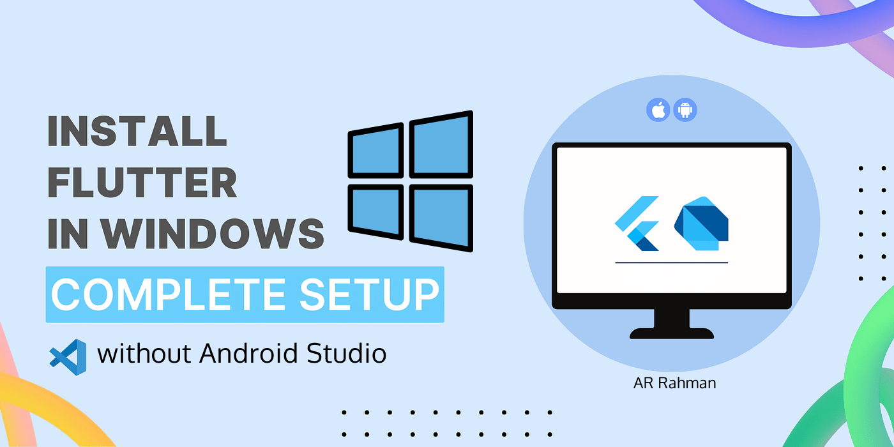
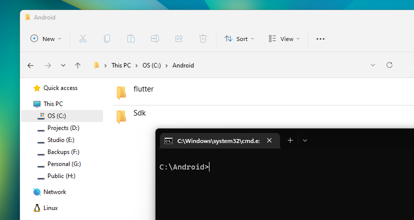
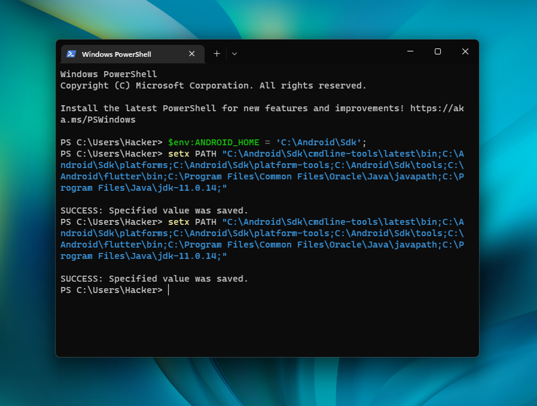

# Setup Android SDK without Android Studio

[](https://storage.googleapis.com/flutter_infra_release/releases/stable/windows/flutter_windows_3.0.2-stable.zip)


After upgrading to Flutter 3.0++ , It's very complicated to setup Android SDK Toolchain.
Neither Choco Package Manager nor Official Documentation working Properly.
That's why I have collected Android SDK Toolchan , build tools, commandline Tools for easy setup

## Required Files Download Link ✨:


Download All of those files:

[](https://docs.flutter.dev/release/archive?tab=windows)
[](https://files02.tchspt.com/down/jdk-18.0.2.1_windows-x64_bin.exe)

[](https://github.com/arrahmanbd/flutter-doctor/releases/download/sdk_win_v1.0/Android_SDK.rar)


## Installation

 1. Extract <b>Android_SDK.rar</b> using winRar to your system root directory.


```bash
  C:\
```
2. Install Java as normally any other software you Install.

3. Extract <b>flutter_sdk.zip</b> using winRar to <b>Android</b> directory previously we created.


```bash
  C:\Android\
```


## Folder Hierarcy

All Files and Folder will Look Like This Hirecry Right?



## Environment Variables

There are two way:
1. Run the <b>command.bat</b> file. <b>(Recommended ✨)</b>
  
    [](./files/command.bat)

1. Or, manually running the commands in 


Open Windows Powershell and then paste below commands one by one, like the picture below.

```bash
$env:ANDROID_HOME = 'C:\Android\Sdk';

set PATH "C:\Android\Sdk\cmdline-tools\latest\bin;C:\Android\Sdk\platforms;C:\Android\Sdk\platform-tools;C:\Android\Sdk\tools;C:\Android\flutter\bin;C:\Program Files\Common Files\Oracle\Java\javapath;C:\Program Files\Java\jdk-11.0.14;"

setx PATH "C:\Android\Sdk\cmdline-tools\latest\bin;C:\Android\Sdk\platforms;C:\Android\Sdk\platform-tools;C:\Android\Sdk\tools;C:\Android\flutter\bin;C:\Program Files\Common Files\Oracle\Java\javapath;C:\Program Files\Java\jdk-11.0.14;"
```
## Powershell Screenshot




## Enable Screen Mirroring 📱
Simply run the Reg file. Screen mmirroring option will be shown on Right-Click context menu.

[](./files/screen_mirroring.reg)


Everything is set. You may restart your PC and see the magic 👏.

## 🚀 Happy Fluttering 😍
[](https://www.linkedin.com/in/arrahmanbd)
[](https://www.github.com/arrahmanbd)
[](https://www.facebook.com/arrahman.dev)

License
-------

This project is licensed under the [MIT License](LICENSE).
